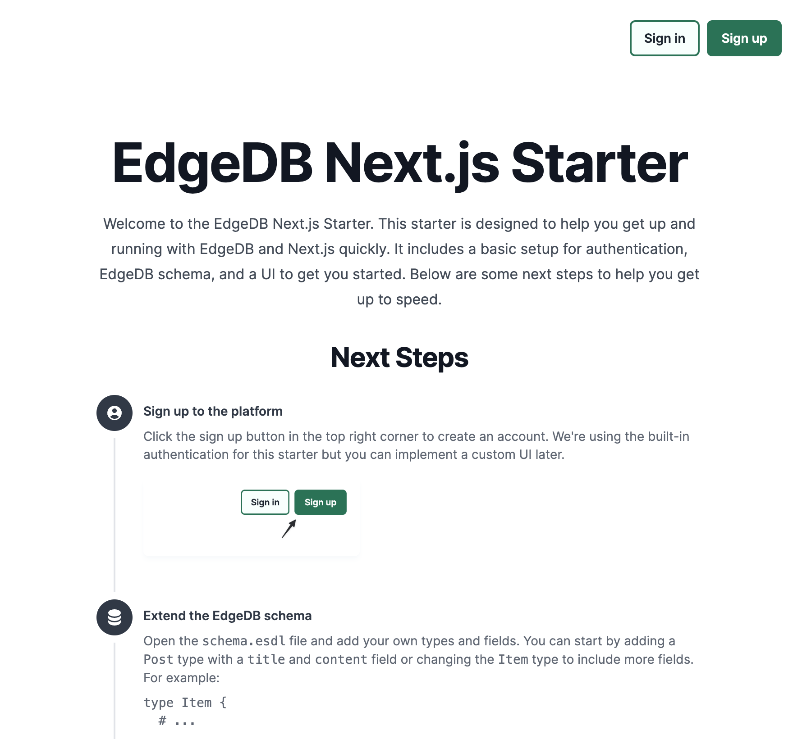
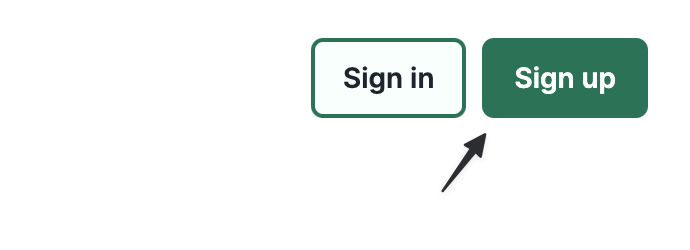
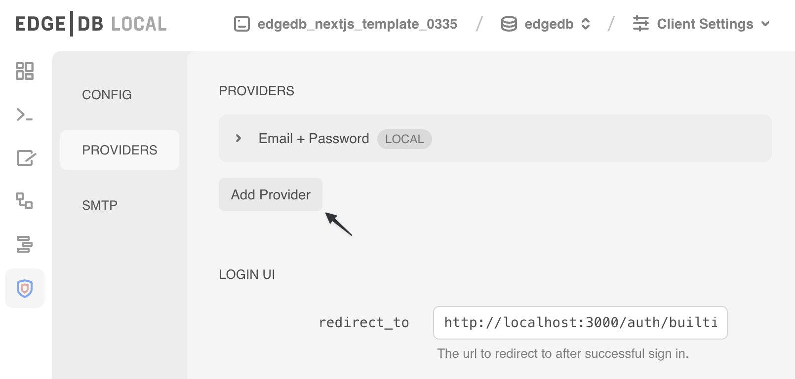
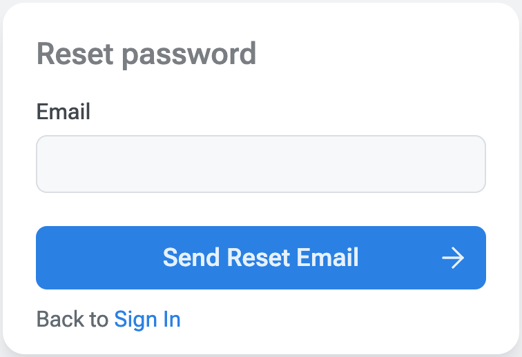
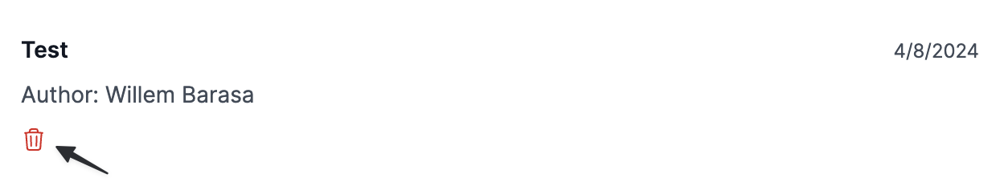

# 🎉 Next.js + EdgeDB + EdgeDB Auth template

This starter is designed to help you get up and running with EdgeDB and Next.js quickly. It includes a basic setup for authentication, EdgeDB schema, and a UI to get you started. Below you can find the steps to set up the project and start building your app as well as some ideas for extending it further.

This template includes:

- [Next.js](https://nextjs.org) for React framework
- [EdgeDB](https://edgedb.com) for database
- [EdgeDB Auth](https://edgedb.com/docs/guides/auth) for authentication
- [Tailwind CSS](https://tailwindcss.com) for utility-first CSS framework
- [ESLint](https://eslint.org) for linting



## 🧐 What's inside?

```sh
.
├── README.md
├── app
│   ├── auth
│   ├── dashboard
│   ├── favicon.ico
│   ├── globals.css
│   ├── layout.tsx
│   └── page.tsx
├── auth-setup.ts
├── components/
├── src/
├── public/
├── dbschema
│   ├── default.esdl
│   └── migrations
├── edgedb.toml
├── edgedb.ts
├── eslint.config.js
├── next-env.d.ts
├── next.config.js
├── package.json
├── password-auth-setup.ts
├── pnpm-lock.yaml
├── postcss.config.js
├── tailwind.config.ts
└── tsconfig.json
```

Directory structure:

- `app/` - Next.js pages and components
- `public/` - static assets
- `components/` - React components
- `src/` - utility functions
- `dbschema/` - EdgeDB schema and migrations
- `edgedb.toml` - EdgeDB configuration
- `edgedb.ts` - EdgeDB client
- `auth-setup.ts` - script to set up EdgeDB Auth
- `password-auth-setup.ts` - script to set up email+password authentication
- `eslint.config.js` - ESLint configuration
- `next-env.d.ts` - Next.js types
- `next.config.js` - Next.js configuration
- `package.json` - npm dependencies
- `pnpm-lock.yaml` - pnpm lockfile
- `postcss.config.js` - PostCSS configuration
- `tailwind.config.ts` - Tailwind CSS configuration
- `tsconfig.json` - TypeScript configuration

## 🚀 Quick start

To get started with this template, you need to:

### 1. Clone the repository

```sh
git clone https://github.com/beerose/edgedb-nextjs-auth-template.git
cd edgedb-nextjs-auth-template
```

You can also click the "Use this template" button to create a new repository based on this template.

### 2. Install EdgeDB CLI

```sh
curl --proto '=https' --tlsv1.2 -sSf https://sh.edgedb.com | sh
```

For more installation options, see the [EdgeDB installation guide](https://edgedb.com/docs/guides/install).

### 3. Initialize EdgeDB project

To run this project, you need to initialize a new EdgeDB project. Run the following command:

```sh
edgedb project init
```

### 4. Apply migrations

To apply the initial migration, run:

```sh
edgedb migration apply
```

### 5. Set up EdgeDB Auth

This template includes a script to set up EdgeDB Auth. It defaults to email+password authentication. Run the following command:

```sh
pnpm auth:setup
```

To set up other authentication providers, run:

```sh
pnpm esr auth-setup.ts
```

### 6. Generate types

This template includes a script to generate TypeScript types from the EdgeDB schema. Run the following command:

```sh
pnpm generate:all
```

### 7. Start the development server

```sh
pnpm dev
```

Follow the instructions in the terminal to open the app in your browser.

### 8. Open the EdgeDB UI

To view the database in the EdgeDB UI or make changes to the EdgeDB Auth configuration, run:

```sh
edgedb ui
```

## ✨ Next steps

### Sign up and create an account

Click the sign up button in the top right corner to create an account.
We're using the built-in authentication for this starter but you can
implement a custom UI later.

<p align="center">
  
</p>

### Extend the EdgeDB schema

Open the `schema.esdl` file and add your own types and
fields. You can start by adding a `Post` type with a
`title` and `content` field or changing the
`Item` type to include more fields. For example:

```sql
type Item {
  # ...

  # Add your new fields here:
  required title: str;
  required content: str;
}
```

### Edit the EdgeDB query

Open the `app/dashboard/page.tsx` file and update the query
to include your new fields. You can add a new field to the query or
change the existing fields to include your new data.

```ts
const itemsQuery = e.select(e.Item, (\_item) => ({
  id: true,
  name: true,
  created: true,
  updated: true,
  created_by: {
    name: true,
  },
  // Add your new fields here
}))
```

### Add more Auth providers

Open the EdgeDB UI with the `edgedb ui` command and navigate
to the Auth tab. Go to the "Providers" section and add a new Auth
provider by clicking the "Add Provider" button and following the
instructions.

<p align="center">
  
</p>

### Test the reset password flow

Sign out of your account and try to reset your password. Click the
"Forgot Password" link on the login page and follow the instructions to
reset your password. You should receive an email with a link to reset
your password. To test it locally, you can use the Mailpit tool.

<p align="center">
  
</p>

To set up the Mailpit tool, run the following command:

```sh
brew install mailpit
```

Or follow the instructions in the [Mailpit docs](https://mailpit.axllent.org/docs/install/).

Next, run the following command to start the Mailpit server:

```sh
mailpit
```

After that, you can open the Mailpit UI in your browser at `http://localhost:8025`.

#### Updating the SMTP settings in the EdgeDB UI

To test the reset password flow with Mailpit, you need to update the SMTP settings in the EdgeDB UI. Open the EdgeDB UI with the `edgedb ui` command and navigate to the Auth tab. Go to the "SMPT" section and update the settings with the following values:

- Host: `localhost`
- Port: `1025`

The remaining fields can be left empty.

### Extend the "New Item" form

Open the `components/AddItem.tsx` file and update the form to
include your new fields. You can add a new field to the form or change
the existing fields to include your new data.

<p align="center">
  
</p>

### Test access policies

Try deleting an item that you don't own. You shouldn't be able to delete
it. You can test this by creating a new item and then trying to delete
it with a different account. As a next step you can conditionally render
the delete button based on the user's permissions.

<p align="center">
  
</p>

### Modify the UI callback

In the `app/auth/[...auth].tsx` file, you can find the post creation flow. You can modify this flow to include additional steps. For example, you can send a custom email to the new user or store additional data in the database.

## 👀 Quick look at the EdgeDB schema

In the `dbschema/default.esdl` file, you can find the EdgeDB schema for this template. It includes the `User` and `Item` types with some basic fields and access policies. Here's a quick look at the schema:

```sql
using extension auth;
```

This line enables the EdgeDB Auth extension, which provides built-in authentication and authorization features.

```sql
  global current_user := (
    assert_single((
      select User { id, name, email, userRole }
      filter .identity = global ext::auth::ClientTokenIdentity
    ))
  );

  scalar type Role extending enum<admin, user>;

  type User {
    required identity: ext::auth::Identity;
    required name: str;
    email: str;

    userRole: Role {
      default := "user";
    };

    created: datetime {
      rewrite insert using (datetime_of_statement());
    }
    updated: datetime {
      rewrite insert using (datetime_of_statement());
      rewrite update using (datetime_of_statement());
    }
  }
```

This block defines the `Role` and `User` types. The `User` type includes fields for the user's identity, name, email, role, and timestamps for when the user was created and updated.

- The `identity` field is an EdgeDB Auth identity that uniquely identifies the user. It's created when the user signs up and is used for authentication. We link it to our custom `User` type with the `ext::auth::Identity` type.

- The `global current_user` function retrieves the current user based on the client token identity. It selects the user's `id`, `name`, `email`, and `userRole` fields from the `User` type.

- The `userRole` field is an enum that defines the user's role. It defaults to "user" but can be set to "admin" for users with admin privileges.

- The `created` and `updated` fields are timestamps that are set when the user is created or updated.

```sql
  type Item {
    required name: str;
    required created_by: User {
      default := global current_user;
    }

    created: datetime {
      rewrite insert using (datetime_of_statement());
    }
    updated: datetime {
      rewrite insert using (datetime_of_statement());
      rewrite update using (datetime_of_statement());
    }

    access policy admin_has_full_access
      allow all
      using (global current_user.userRole ?= Role.admin);
    access policy creator_has_full_access
      allow all
      using (.created_by ?= global current_user);
    access policy others_read_only
      allow select, insert;
  }
```

This block defines the `Item` type. It includes fields for the item's name, creator, and timestamps for when the item was created and updated.

- The `created_by` field is a reference to the `User` type that stores the user who created the item. It defaults to the currently authenticated user.
- The `created` and `updated` fields are timestamps that are set when the item is created or updated.
- The `access policy` blocks define the access policies for the `Item` type. They specify who can read, insert, update, or delete items based on the user's role and the item's creator.

  - The `admin_has_full_access` policy allows users with the "admin" role to perform all actions on items.
  - The `creator_has_full_access` policy allows the item's creator to perform all actions on the item.
  - The `others_read_only` policy allows other users to read and insert items but not update or delete them.

## 👩‍🏫 Learn More

To learn more about Next.js, take a look at the following resources:

- [Next.js Documentation](https://nextjs.org/docs) - learn about Next.js features and API.
- [Learn Next.js](https://nextjs.org/learn) - an interactive Next.js tutorial.

You can also check out the [EdgeDB documentation](https://edgedb.com/docs) to learn more about EdgeDB and EdgeDB Auth.

## ☁️ Deployment

Follow the deployment instructions in the [EdgeDB documentation](https://docs.edgedb.com/guides/tutorials/nextjs_app_router#deploying-to-vercel) to deploy your Next.js app to EdgeDB Cloud and Vercel.
